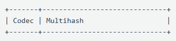
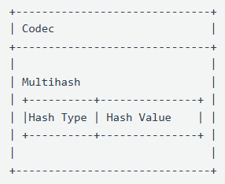

This repo contain my notes for decentralized web concepts, protocols, and tools learned from [ProtoSchool](https://proto.school/)...

---

## 1. Content Addressing on the Decentralized Web

  1. URLs are based on the location where data is stored, not on the contents of the resource stored there. This is called _location addressing_.

  2. Cryptographic hashing is the most important tool in the toolbox of decentralized data structures. It opens the door to a new form of linking, known as _content addressing_, that liberates us from reliance on central authorities.
  
     - Hashing takes data of any size and type and returns a single, fixed-size "hash" that represents it. A hash is a string of characters, a unique name for the data.

     - Cryptographic hashes can be derived from the content of the data itself, meaning that anyone using the same algorithm on the same data will arrive at the same hash.

     - Cryptographic hashes are unique.

     Content addressing can be used on all different types of files and data.

  3. A [CID (Content Identifier)](https://docs.ipfs.tech/concepts/content-addressing/) is a particular form of content addressing used on the decentralized web.

     - A CID is a single identifier that contains both a **cryptographic hash** and a **codec**, which holds information about how to interpret that data. Codecs encode and decode data in certain formats.

        

     - Tools like Git and protocols like Ethereum and Bitcoin use content addressing but they differ in how to interpret the data and in what cryptographic function they use for hashing. CID allows us to create a universal identifier for any of these systems.

     - Every CID is an identifier that contains the [codec](https://github.com/multiformats/multicodec) to interpret the data and a [multihash](https://github.com/multiformats/multihash) which is a self-describing hash (a hash that tells us what type of hashing function was used to create it).

        

  4. Cryptographic hash of a particular piece of data can be used as a link to retrieve that data from peers on the decentralized web. However, CIDs can be used to express data structures, conveying meaning about the relationships between various pieces of data.
