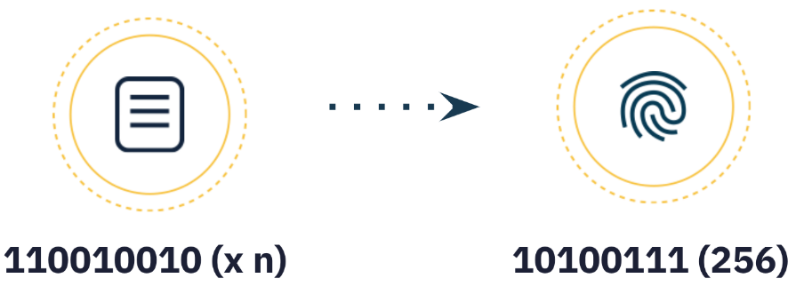
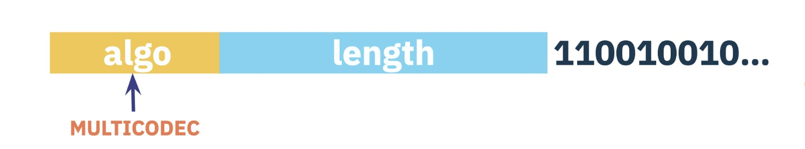

This repo contain my notes for decentralized web concepts, protocols, and tools learned from [ProtoSchool](https://proto.school/)...

---

## 1. Content Addressing on the Decentralized Web

   Hashing & content addressing enable verifiable data sharing with peers on the decentralized web.

   1. URLs are based on the location where data is stored, not on the contents of the resource stored there. This is called _location addressing_.

   2. Cryptographic hashing is the most important tool in the toolbox of decentralized data structures. It opens the door to a new form of linking, known as _content addressing_, that liberates us from reliance on central authorities.
  
      - Hashing takes data of any size and type and returns a single, fixed-size "hash" that represents it. A hash is a string of characters, a unique name for the data.

      - Cryptographic hashes can be derived from the content of the data itself, meaning that anyone using the same algorithm on the same data will arrive at the same hash.

      - Cryptographic hashes are unique.

      Content addressing can be used on all different types of files and data.

   3. A [CID (Content Identifier)](https://docs.ipfs.tech/concepts/content-addressing/) is a particular form of content addressing used on the decentralized web.

      - A CID is a single identifier that contains both a **cryptographic hash** and a **codec**, which holds information about how to interpret that data. Codecs encode and decode data in certain formats.
     
         

      - Tools like Git and protocols like Ethereum and Bitcoin use content addressing but they differ in how to interpret the data and in what cryptographic function they use for hashing. CID allows us to create a universal identifier for any of these systems.

      - Every CID is an identifier that contains the [codec](https://github.com/multiformats/multicodec) to interpret the data and a [multihash](https://github.com/multiformats/multihash) which is a self-describing hash (a hash that tells us what type of hashing function was used to create it).
     
         

   4. Cryptographic hash of a particular piece of data can be used as a link to retrieve that data from peers on the decentralized web. However, CIDs can be used to express data structures, conveying meaning about the relationships between various pieces of data.

## 2. Anatomy of a CID

   CIDs (Content Identifiers) are the unique labels used to point to data stored on distributed information systems including IPFS, IPLD, libp2p, and Filecoin.

   1. What is a CID?

      - The [CID specification](https://github.com/multiformats/cid), which originated in IPFS, now lives in Multiformats and supports a broad range of projects including IPFS, IPLD, libp2p, and Filecoin.

      - A content identifier, or CID, is a self-describing content-addressed identifier. It doesn't indicate where content is stored, but it forms a kind of address based on the content itself.

      - The number of characters in a CID depends on the cryptographic hash of the underlying content, rather than the size of the content itself. Most content in IPFS is hashed using `sha2-256` & there will be the same size (256 bits, which equates to 32 bytes).

      - The first step to creating a CID is to transform the input data, using a **cryptographic algorithm** that maps input of arbitrary size (data or a file) to output of a fixed size. This transformation is known as **cryptographic hash digest** or simply **hash**.
      
         

      - The cryptographic algorithm used must generate hashes that have the following characteristics:

         - ***Deterministic***: The same input should always produce the same hash.

         - ***Uncorrelated***: A small change in the input should generate a completely different hash.

         - ***One-way***: It should be infeasible to reconstruct the data from the hash.

         - ***Unique***: Only one file can produce one specific hash.

      - Cryptographic hashing is not unique to IPFS, and there are many hashing algorithms out there like sha2-256, blake2b, sha3-256 and sha3-512, the no-longer-secure sha1 and md5, etc. IPFS uses `sha2-256` by default, though a CID supports virtually any strong cryptographic hash algorithm.

   2. Multihash

      - A [multihash](https://multiformats.io/multihash/) is a self-describing hash which itself contains metadata that describes both its length and what cryptographic algorithm generated it. Multiformats CIDs are future-proof because they use multihash to support multiple hashing algorithms rather than relying on a specific one.

      - Multihashes follow the `TLV` pattern (type-length-value). Essentially, the "original hash" is prefixed with the type of hashing algorithm applied and the length of the hash.

         

         - ***type***: identifier of the cryptographic algorithm used to generate the hash (e.g. the identifier of `sha2-256` would be `18` - `0x12` in hexadecimal) - see the [multicodec table](https://github.com/multiformats/multicodec/blob/master/table.csv) for all the identifiers.

         - ***length***: the actual length of the hash (using `sha2-256` it would be `256` bits, which equates to 32 bytes).

         - ***value***: the actual hash value.

      - In order to represent a CID as a compact string instead of plain binary (a series of 1s and 0s), the *base encoding* is used.

      - Multihash formatting and `base58btc` encoding enabled this first version of the CID, now referred to as Version 0 (`CIDv0`), and its initial `Qm...` characters remain easy to spot. An example of `CIDv0` is, *QmY7Yh4UquoXHLPFo2XbhXkhBvFoPwmQUSa92pxnxjQuPU*.

   3. 